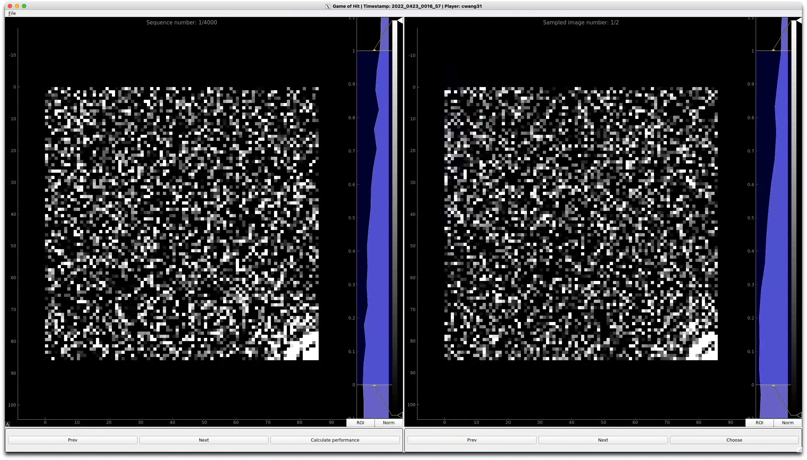

# Game of Hits



A GUI for measuring SPI classification performance of human. 


## Install with `pip`

```
pip install git+https://github.com/carbonscott/game_of_hits --upgrade --user
```


## Dependency

```
pyqtgraph
numpy
```

## Shortcuts

- `J`: next query image (left panel)
- `K`: prev query image (left panel)
- `L`: next image to compare (right panel)
- `H`: prev image to compare (right panel)
- `C`: choose image in the right panel that belongs to the same category as the
  image in the left panel.  (make your best guess)
- `G`: go to a specific event


## To do

- [x] Apply preprocess to images.
- [x] Record a player's status
